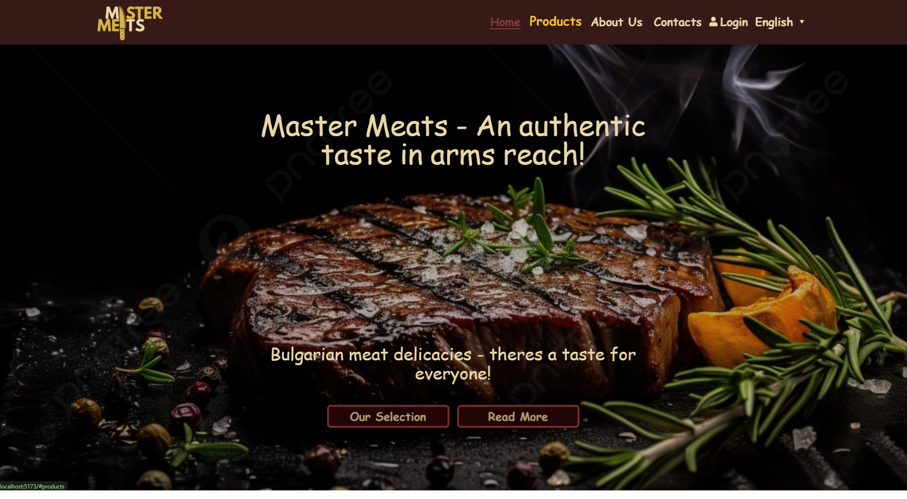
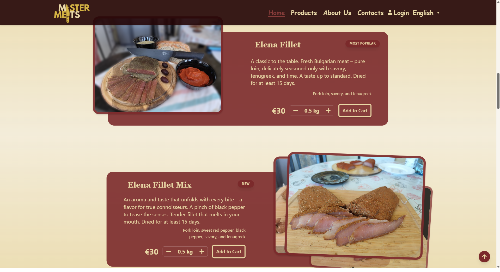
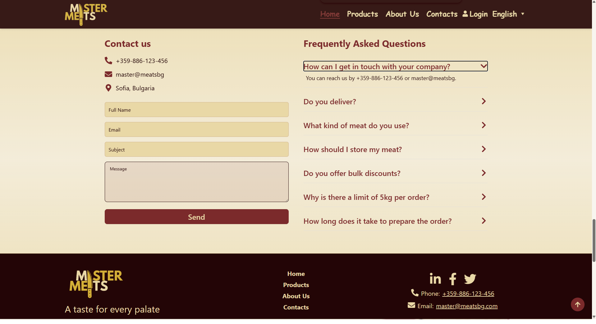
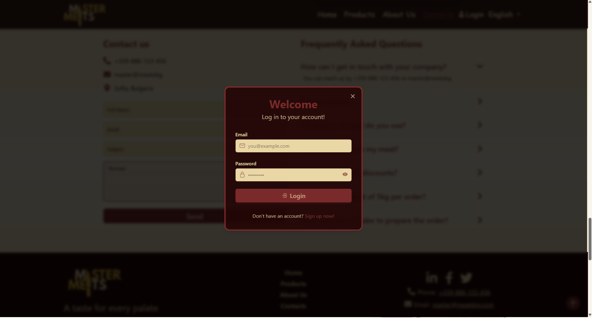
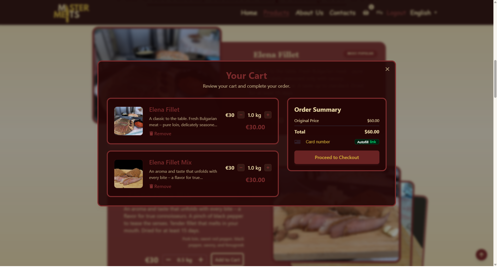
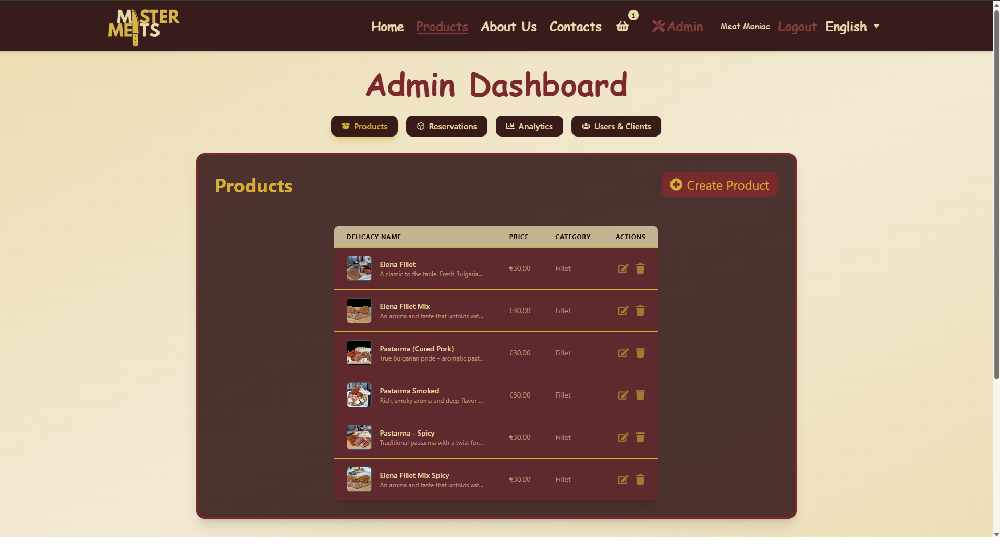
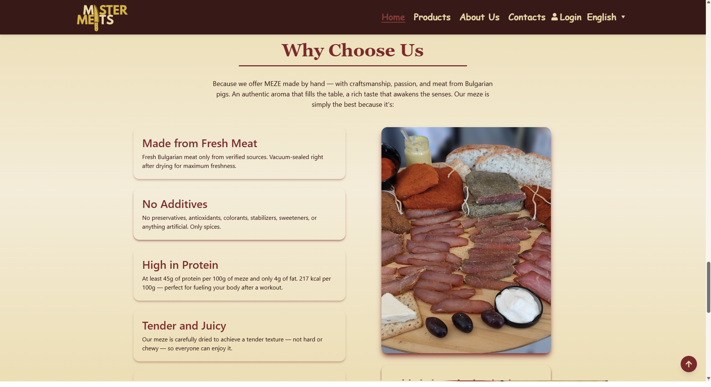
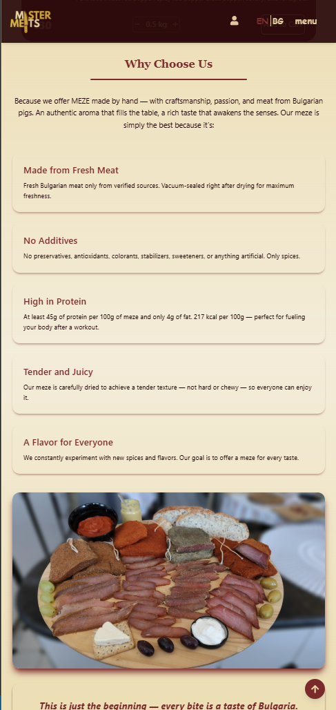
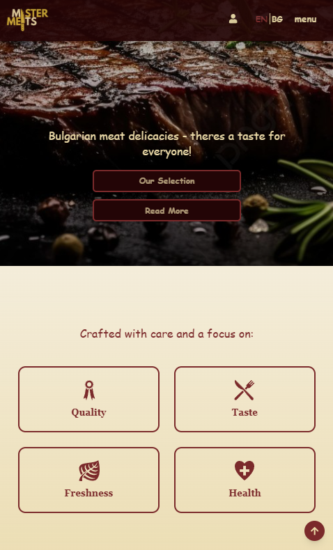
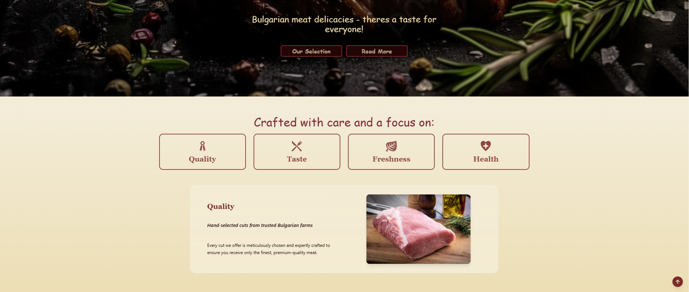

  
  
  
# MasterMeats – Traditional Bulgarian Meat Delicacy Platform

MasterMeats is a full-stack web application I’m developing for a traditional Bulgarian meat delicacy company to **enable online ordering and internal production management**.  
This is a freelance project and my first opportunity to work directly with a client, bringing their vision to life.  
The platform includes a secure admin dashboard for managing products, orders, reservations, online users, and in-person clients.  
It also provides **secure authentication**, a payment system using Stripe, and cloud-based media management via Cloudinary.

---

## Overview

This project is built as a full-stack web solution from scratch.  
It delivers a responsive, modern frontend for users to place orders and interact with the platform, while the backend manages authentication, order processing, and production data.  
The admin dashboard allows internal staff to manage products, clients, reservations, and orders efficiently.  
The platform is in active development, with production operations and data management features being implemented.

---

## What I Learned

Working on MasterMeats has been an incredible learning experience:  
- Exposure to **a wide range of technologies** including React, TailwindCSS, Node.js, Express, MongoDB, Cloudinary, Stripe, and Redis  
- Hands-on experience building **secure authentication and JWT-based sessions**  
- Integrating **Stripe payments** for online ordering  
- Creating a **dynamic admin dashboard** for internal operations  
- Learning to balance **client needs, usability, and technical implementation**  

---

## Features

  
- User authentication (login/logout, JWT-based sessions)  
  
- Online order management with Stripe payment integration  
  
- Admin dashboard for managing products, online users, reservations, orders, and in-person clients  
    
   

- Responsive frontend built with React.js, TailwindCSS, and DaisyUI  
- Cloud-based image storage and optimization with Cloudinary  
- Dynamic backend using Node.js, Express.js, RESTful API, bcrypt, MongoDB, and Upstash  

---

## Future Improvements

- Complete production operations management features  
- Enhance analytics and reporting dashboards for internal staff  
- Further optimize UI/UX and accessibility  

---

## Tech Stack

**Frontend:** React.js, HTML5, TailwindCSS, DaisyUI, Axios, Stripe JS  
**Backend:** Node.js, Express.js, RESTful API, bcrypt, Stripe  
**Database & Storage:** MongoDB, Upstash, Cloudinary  

---

## Installation & Setup

1. **Clone the repository**
```bash
git clone https://github.com/TrayanStefanov/MasterMeats.git
cd MasterMeats
```

### 2. Install frontend and backend dependancies
```bash
npm install
npm install --prefix frontend
```

### 4. Configure environment variables

Create a .env file in the backend folder:

```ini
PORT=5000
MONGO_URL=your_mongodb_connection_string
UPSTASH_REDIS_URL=your_upstash_redis_url
ACCESS_TOKEN_SECRET=your_jwt_access_secret
REFRESH_TOKEN_SECRET=your_jwt_refresh_secret
CLOUDINARY_CLOUD_NAME=your_cloudinary_name
CLOUDINARY_API_KEY=your_cloudinary_key
CLOUDINARY_API_SECRET=your_cloudinary_secret
STRIPE_SECRET_KEY=your_stripe_secret_key
CLIENT_URL=http://localhost:5173
NODE_ENV=development
```
### 5. Run the application
```bash
npm run dev
```
The frontend should now be running at http://localhost:5173
 and communicating with the backend API at http://localhost:5000.
---

## Live Demo Website

**Website:** 

[https://mastermeats-frontend.onrender.com](https://mastermeats-frontend.onrender.com)
